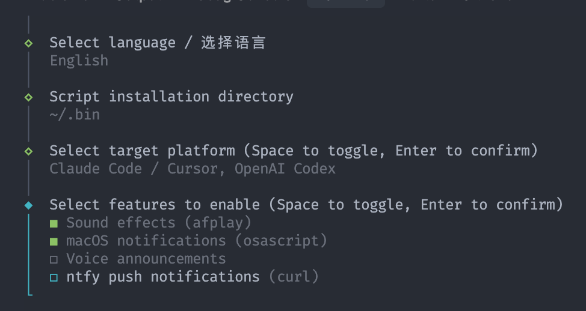
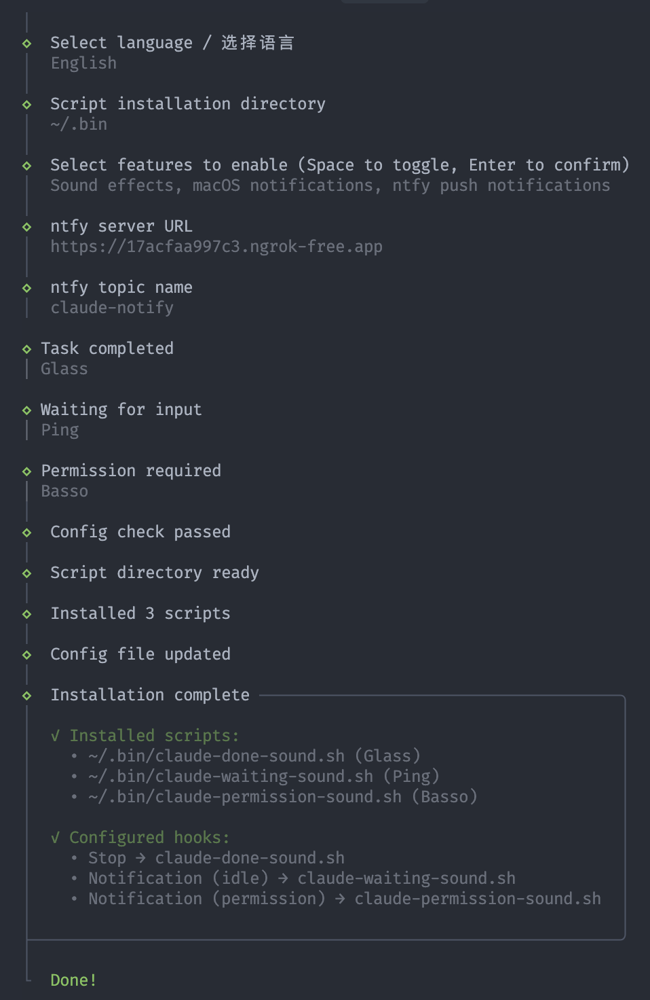
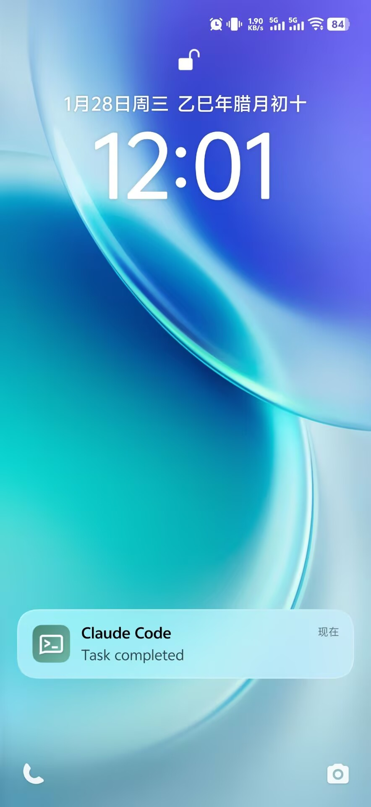

# claude-notify

[中文](./README.zh-CN.md)

Notifications for [Claude Code](https://docs.anthropic.com/en/docs/claude-code) on macOS.

Get notified when Claude:
- Completes a task
- Waits for your input
- Requests permission

**Features (all optional):**
- Sound effects (system sounds)
- macOS notifications (Notification Center)
- Voice announcements (say command)
- ntfy push notifications (self-hosted or ntfy.sh)

## Screenshots







## Install

```bash
# Using Bun
bun install && bun run dev

# Or download the binary from Releases
xattr -d com.apple.quarantine ./claude-notify-arm64  # Remove quarantine
chmod +x ./claude-notify-arm64
./claude-notify-arm64
```

> **Note:** macOS blocks unsigned binaries by default. Run `xattr -d com.apple.quarantine <file>` to allow execution.

## Build

```bash
bun run build
```

## Self-hosted ntfy (Optional)

If you want to use ntfy push notifications with your own server:

```bash
docker compose up -d
```

This will start a ntfy server on port 1145. Configure the ntfy URL during setup.

## License

MIT
