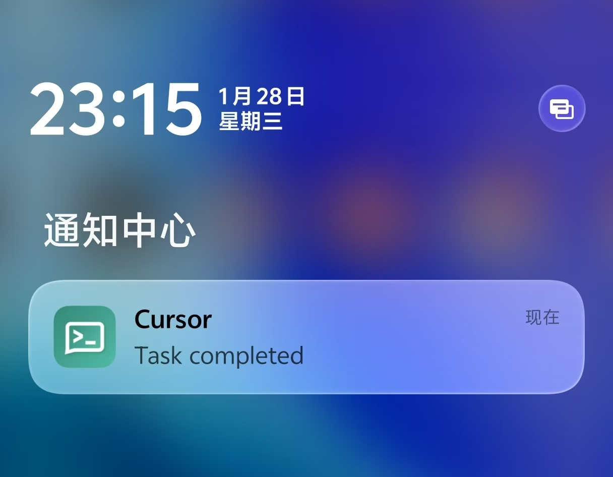

# agent-notify

[中文](./README.zh-CN.md)

Notifications for AI coding agents on macOS.

```bash
curl -fsSL https://raw.githubusercontent.com/cfngc4594/agent-notify/main/install.sh | bash
```

## Features

- Works with [Claude Code](https://docs.anthropic.com/en/docs/claude-code), [Cursor](https://cursor.sh), and [OpenAI Codex](https://openai.com/index/openai-codex/)
- Sound effects (system sounds)
- macOS notifications (Notification Center)
- Voice announcements (say command)
- ntfy push notifications (self-hosted or ntfy.sh)

Get notified when task completes.




## Install

### One-line install (recommended)

```bash
curl -fsSL https://raw.githubusercontent.com/cfngc4594/agent-notify/main/install.sh | bash
```

### Manual download

```bash
# Apple Silicon (M1/M2/M3/M4)
curl -fsSL https://github.com/cfngc4594/agent-notify/releases/latest/download/agent-notify-arm64 -o agent-notify

# Intel Mac
curl -fsSL https://github.com/cfngc4594/agent-notify/releases/latest/download/agent-notify-x64 -o agent-notify

chmod +x agent-notify
./agent-notify
```

### From source

```bash
bun install && bun run dev
```

## Configuration

All three platforms are **automatically configured** by the installer:

| Platform | Config File | Hook |
|----------|-------------|------|
| Claude Code | `~/.claude/settings.json` | `Stop` |
| Cursor | `~/.cursor/hooks.json` | `stop` |
| OpenAI Codex | `~/.codex/config.toml` | `notify` |

The installer shows a **diff preview** before applying changes, so you can review exactly what will be modified. Your existing configuration is preserved.

> **Note:** Since each platform supports different hook events, only the "task completion" hook is configured for consistency across all platforms.

### Using Both Claude Code and Cursor

If you use both Claude Code and Cursor, Cursor will load Claude Code's hooks by default (via "Include third-party skills" setting), which may cause **duplicate notifications**.

To avoid this, disable the option in Cursor:

**Settings → Rules, Skills, Subagents → Include third-party skills, subagents, and other configs → OFF**

## Self-hosted ntfy (Optional)

If you want to use your own ntfy server instead of [ntfy.sh](https://ntfy.sh):

```bash
docker compose up -d
```

Default port is 80. To use a different port, edit `docker-compose.yml`:

```yaml
ports:
  - 8080:80  # Change 8080 to your preferred port
```

Then enter `http://localhost:8080` as the ntfy URL during setup.

## License

MIT
