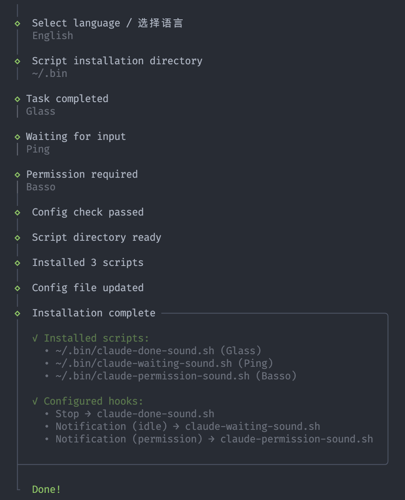

# claude-notify

[English](./README.md)

为 macOS 上的 [Claude Code](https://docs.anthropic.com/en/docs/claude-code) 添加声音通知。

当 Claude 发生以下情况时播放提示音：
- 任务完成
- 等待输入
- 请求权限

## 截图



## 安装

```bash
# 使用 Bun
bun install && bun run dev

# 或从 Releases 下载可执行文件
./claude-notify
```

## 构建

```bash
bun run build
```

## 许可证

MIT
